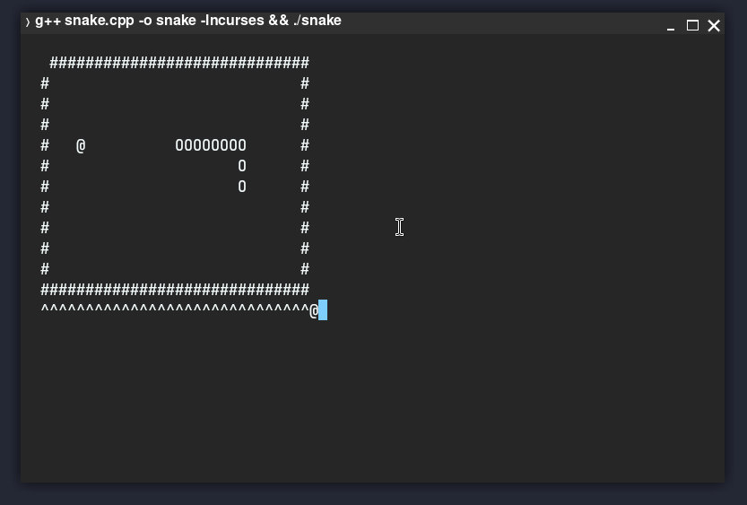

# Console snake game



## A simple snake game in console in C++, available only on Linux.

### Controls:
Arrows ←, →, ↑, ↓

### Feature:

You can hold down any arrow for turbo accelerated movement of the snake, it's something like "dash". Initially, I did not plan such functionality, but I noticed it and decided to leave it :)


### Usage

```bash
g++ snake.cpp -o snake -lncurses && ./snake
```

or another your C++ compiler